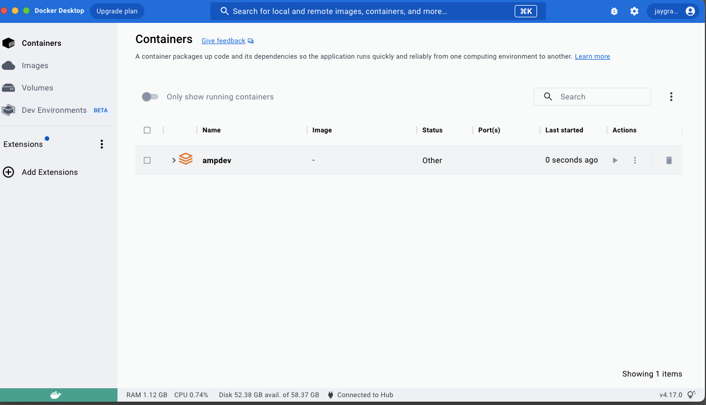

.. 3111170000:

Next Steps
##########

Make Mac work
*************

Current configuration
=====================

* OS: Monterey

* Terminal: zsh

* Editor: TextEdit or TextMate

* Docker version: 20.10.23 build 7155243

* GitHub PAT: ghp_b8UQyi3mt0LL6swTGC4WaX1i0e + 10 more

Current Docker desktop
======================

* Planning to delete ampdev

* Planning to store AFDSI/websites in same directory

Make Windows work
*****************

Current configuration
=====================

* WSL: uninstalled

* Docker: uninstalled

Current Windows desktop
=======================

* Clean install WSL on external drive

https://dev.to/mefaba/installing-wsl-on-another-drive-in-windows-5c4a

https://learn.microsoft.com/en-us/windows/wsl/tutorials/wsl-containers

.. include:: substitution.txt

