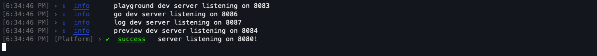

.. image:: _images/onto-logo-text-blue-w325-h60.svg
   :align: left
   :width: 30%
   :alt: Ontomatica logo

|br|
|br|
|br|

Sphinx Catalogue
----------------

:Project: `Websites Docker Setup <https://example.com/index.html>`_
:Author: `Jay Gray <https://ontomatica.io>`_
:Organization: `Ontomatica <https://dailyfood.io>`_
:Date: 19 March 2023

.. image:: _images/docs-latest.svg
   :align: left
   :width: 7%

|br|

Docker Setup
============

The docker setup for AFDSI/websites is created for both local
development environment and production environment.

Separate “Dockerfiles” and “docker-compose.yml” has been provided to
cater both the environments, considering the different requirements, and
usage.

Let’s discuss each one of them in detail.

Local Development Environment:
==============================

The docker setup for local dev env has been designed with the following
considerations:

The codebase will reside on the host, so that if developers would like
to use their favorite IDEs, they can without any issues. Also, they can
develop/change the code the way they have been doing so far.

The method to reflect the changes to the code has also been kept very
similar to facilitate smooth transition.

At the same time, it is important to ensure that the development env
remains consistent across different Operating Systems/platforms.

For the same docker comes to the rescue. The idea is to have the
dependencies packaged within a docker Image and the code to be shared
between the host and the container via “bind-mount” docker volume.

So, the container would have dependencies per-installed/baked as per the
Dockerfile and the code will be accessible to it via docker volume.

Developers can do the changes as usual and to bring them to effect they
need to follow the below steps. Flexibility to transition from docker to
non-docker env or vice-versa is ensured.

Pre-requisites:
===============

MacOS
-----

`Docker Desktop for Mac <https://docs.docker.com/desktop/mac/install/>`_

Windows 
-------

`Docker Desktop for Windows <https://docs.docker.com/desktop/windows/install/>`_

`WSL 2 <https://docs.microsoft.com/en-us/windows/wsl/install>`_

`Ubuntu 20.04 LTS Distribution <https://www.microsoft.com/en-in/p/ubuntu-2004/9n6svws3rx71?rtc=1&activetab=pivot:overviewtab>`_

`Windows Terminal <https://www.microsoft.com/en-us/p/windows-terminal/9n0dx20hk701?activetab=pivot:overviewtab>`_

Linux Bare Metal 
----------------

Ubuntu 18.04/20.04 LTS 

`Docker <https://docs.docker.com/engine/install/ubuntu/>`_

`docker-compose <https://docs.docker.com/compose/install/>`_

Steps to setup the local dev env
================================

Fully Automated Method
----------------------

Clone the repo
~~~~~~~~~~~~~~

git clone `https://github.com/AFDSI/websites.git <https://github.com/div1127/amp.dev.git>`_ -b docker-updates

Note: For now, you may use the above-mentioned repository and branch. After your confirmation, I can raise a PR and get this merged to the repo/branch of your choice.

Create a PAT (Personal Access Token) and update docker-compose.yml file.
~~~~~~~~~~~~~~~~~~~~~~~~~~~~~~~~~~~~~~~~~~~~~~~~~~~~~~~~~~~~~~~~~~~~~~~~

Create a PAT:

https://docs.github.com/en/authentication/keeping-your-account-and-data-secure/creating-a-personal-access-token

Once the PAT is generated, copy and paste it on the notepad. 

To setup the local dev env, the script – local-env-setup.sh is created. Please, run the following commands to start the build process.

.. code-block:: bash

   cd websites

   ./local-env-setup.sh --build

The script might take 25-30 minutes. Please, grab a coffee and wait for
it to finish.

If everything goes well, the services will be started and can be accessed on 8080 and 8083 ports. 

If you can see the messages as shown below, it means you are in luck.

Voila!

If you have reached till here, then you may consider the local dev env to be ready. 

Build your changes
~~~~~~~~~~~~~~~~~~

Now, you may do the changes in the codebase as usual. After doing the changes, please issue the command the below command to restart the services and bring the changes into effect.

.. code-block:: bash

   ./local-env-setup.sh --reload

Validate your changes
~~~~~~~~~~~~~~~~~~~~~

You may access the services over the browser on the below mentioned addresses to validate the changes.

http://localhost:8080

http://localhost:8083

Run Bootstrap [Optional]
~~~~~~~~~~~~~~~~~~~~~~~~

Although, during the build process the bootstrap command will run, but still for any reason you want to run the bootstrap command, you may issue the below command:

.. code-block:: bash

   ./local-env-setup.sh --bootstrap

Clean-up of containers, cache, and networks [Recommended]
~~~~~~~~~~~~~~~~~~~~~~~~~~~~~~~~~~~~~~~~~~~~~~~~~~~~~~~~~

With the current local dev env approach, you might see several containers in the “exited” state doing nothing. These containers do not consume CPU and memory but can hog up space. To remove these containers, you can issue the below command.

This command stops (if running) and removes all the AFDSI/websites containers and networks. It does not delete AFDSI/websites image(s), volumes, and source-code.

.. code-block:: bash

   ./local-env-setup.sh --clean

Full Clean-Up [Optional]
~~~~~~~~~~~~~~~~~~~~~~~~

If you ever want to set up everything from the scratch, you can issue the below command. It will delete the “AFDSI/websites” images, networks, and containers. Volumes and repository will not be deleted. That must be deleted manually if needed. 

.. code-block:: bash

   ./local-env-setup.sh –clean-all

Manual Method
-------------

Although the automated method should work for most of the operating
systems, platforms, cloud VMs but If for any reason, it doesn’t work for
your environment/platform, you may use the manual method to setup the
local dev env for you. This method will help you setup things faster,
but has its own limitations.

Clone the repo
~~~~~~~~~~~~~~

git clone `https://github.com/AFDSI/websites.git <https://github.com/div1127/amp.dev.git>`_ -b docker-updates

Note: For now, you may use the above-mentioned repository and branch. After your confirmation, I can raise a PR and get this merged to the repo/branch of your choice.

Create a PAT (Personal Access Token) and update docker-compose-manual.yml file.
~~~~~~~~~~~~~~~~~~~~~~~~~~~~~~~~~~~~~~~~~~~~~~~~~~~~~~~~~~~~~~~~~~~~~~~~~~~~~~~

Create a PAT: 

https://docs.github.com/en/authentication/keeping-your-account-and-data-secure/creating-a-personal-access-token

Once the PAT is generated, copy and update the docker-compose-manual.yml file (environment section).

Build the container and bring up the application.
~~~~~~~~~~~~~~~~~~~~~~~~~~~~~~~~~~~~~~~~~~~~~~~~~

.. code-block:: shell

   docker-compose -f docker-compose-manual.yml up -d

Exec into the container and run commands.
~~~~~~~~~~~~~~~~~~~~~~~~~~~~~~~~~~~~~~~~~

.. code-block:: shell

   docker-compose ps (copy the container name/id from here)

   docker exec -it <container-id>/<name> /bin/bash

After getting the shell, you may run the following commands:

.. code-block:: shell

   npm install

   npm run bootstrap

   npm run develop

Note: 
^^^^^

The container has sleep command as CMD.

\`npm run develop\` will stop as soon as you exit the container. If you like to keep it running, then you may have to run it in background(&) in combination with “nohup”.

Production Docker Environment
=============================

The production docker setup has been created with the following considerations:

The “dockerfile”, “docker-compose.yml” and the resultant “docker image” should be self-contained with everything required to run ontomatica.com.

It should be a fully baked Image. However, it should also be a trimmed docker image without optional packages/dependencies.

Only necessary packages/libraries/binaries should be a part of the docker image. Trimmed, yet self-contained. 

There should be no code sharing between hosts and the containers. 

Minimal volumes “mounts” to avoid any intrusion. 

Steps to spin up production docker environment: 
===============================================

Create a PAT (Personal Access Token) and update docker-compose.yml file.
------------------------------------------------------------------------

Create a PAT: 

https://docs.github.com/en/authentication/keeping-your-account-and-data-secure/creating-a-personal-access-token

Once the PAT is generated, copy it, and update the AMP_DOC_TOKEN parameter inside the “args” section in the docker-compose-prod.yml file. 

.. image:: _images/image2.png
   :alt: Text Description automatically generated
   :width: 4.57856in
   :height: 0.51078in

Build and start the services 

.. code-block:: shell

   docker-compose -f docker-compose-prod.yml up -d 

Stop the services 

.. code-block:: shell

   docker-compose -f docker-compose-prod.yml down 

Clean up and Rebuild
~~~~~~~~~~~~~~~~~~~~

.. code-block:: shell

   *docker-compose* -f docker-compose-prod.yml down --rmi local

   *docker-compose -f* docker-compose-prod.yml up -d –build –force-recreate

Note: The production docker setup is expected to evolve over the period. Further consideration can be sought and incorporated, if needed.

Next
====

Make Mac work
-------------

Current configuration
~~~~~~~~~~~~~~~~~~~~~

* OS: Monterey

* Terminal: zsh

* Editor: TextEdit or TextMate

* Docker version: 20.10.23 build 7155243

* GitHub PAT: ghp_b8UQyi3mt0LL6swTGC4WaX1i0e + 10 more

Current Docker desktop
~~~~~~~~~~~~~~~~~~~~~~

.. image:: _images/image3.png
   :width: 6.5in
   :height: 3.73403in

* Planning to delete ampdev

* Planning to store AFDSI/websites in same directory

Make Windows work
-----------------

Current configuration
~~~~~~~~~~~~~~~~~~~~~

* WSL: uninstalled

* Docker: uninstalled

Next
~~~~

* Clean install WSL on external drive

https://dev.to/mefaba/installing-wsl-on-another-drive-in-windows-5c4a

https://learn.microsoft.com/en-us/windows/wsl/tutorials/wsl-containers

.. include:: substitution.txt
